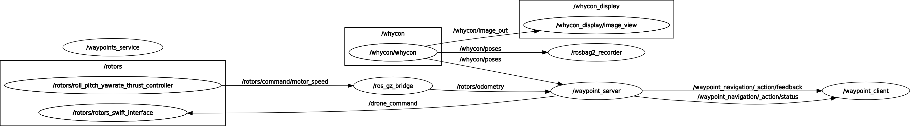
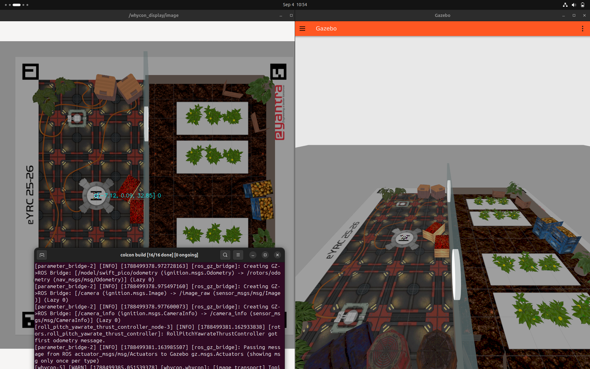
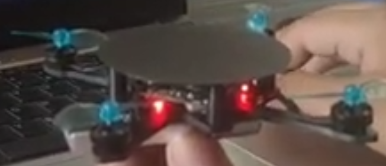
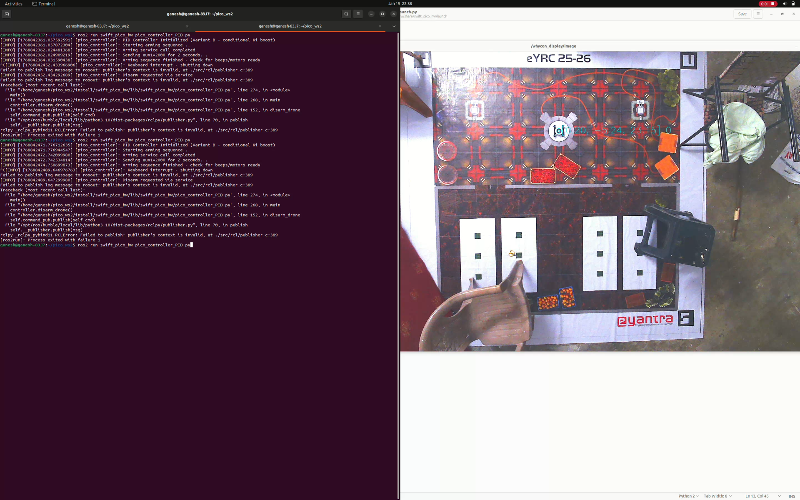

# KD_3570 — Neo Nova

### eYRC 2025-26 · Krishi Drone (KD) Theme

> *An autonomous nano-drone system for greenhouse crop-health monitoring, infected-plant detection, and targeted biopesticide delivery — built for e-Yantra Robotics Competition 2025-26.*

[](https://docs.ros.org/en/humble/)
[](https://www.python.org/)
[](https://gazebosim.org/)
[](LICENSE)
[](#)

## 🎥 Watch the KD_3570 Demonstration Video

> (https://youtu.be/1GM2yyPSchY?si=vmn6M0U92959FTc4)

---

## Highlights

- **Vision-based infection detection:** ArUco-anchored ROI extraction + image processing pipeline to flag infested plants (Task 1A).
- **Stable position hold:** PID-based attitude/position controller holding the Swift Pico drone at a commanded setpoint using WhyCon pose feedback (Task 1C).
- **Autonomous waypoint navigation:** ROS 2 action server/client + waypoint service that sequences the drone through a full mission (Task 2A).
- **Sim-to-real transfer:** The same control architecture re-tuned and hardened for the physical Swift Pico hardware, with arming safety checks and throttle clamping (Task 4B).
- **Recorded evidence:** ROS 2 bag files (`rosbag2`) captured for every graded task, plus an `rqt_graph` snapshot of the live node/topic graph.

---

## Team

| Field | Value |
|---|---|
| Team ID | KD_3570 |
| Team Name | Neo Nova |
| Theme | Krishi Drone (KD), eYRC 2025-26 |

---

## Overview

The Krishi Drone challenge asks a nano-drone to fly inside a smart greenhouse, use an overhead camera feed to detect infested plants, and precisely deliver biopesticide to the affected crop area. The challenge runs in two phases:

1. **Simulation** — Gazebo + ROS 2, using the WhyCon localization system and a simulated Swift Pico drone.
2. **Hardware** — the same control stack, adapted and safety-hardened, deployed on the physical Swift Pico drone.

This repository keeps both phases side by side so the sim code, the hardware code, and the supporting evidence (bag files, graphs, report) all live in one place.

### System Capabilities

| | |
|---|---|
|  *Live ROS 2 node/topic graph (`rqt_graph`) captured during Task 2A* |  *a screenshot of Gazebo + RViz/rqt running side by side* |

### Hardware & Testing Environment

| | |
|---|---|
| *Swift Pico drone hardware* |  *Greenhouse / arena test setup* |

> Drop your actual photos into `docs/figures/` (e.g. `drone_hardware.jpg`, `test_arena.jpg`) and swap the placeholder cells above for ``.

### 🎥 Full System Demonstration

> [Simulation_run ](https://youtu.be/1GM2yyPSchY?si=vmn6M0U92959FTc4)— full run video


---

## Task Breakdown

| Task | Description | Environment | Code | Evidence |
|---|---|---|---|---|
| **1A** | Plant infection detection — ArUco-based ROI extraction + image processing | Simulation | [`task_1a_plant_infection_detection.py`](simulation_ws/src_ours/swift_pico/scripts/task_1a_plant_infection_detection.py) | — |
| **1C** | Position-hold PID controller for the Swift Pico drone | Simulation | [`task_1c_pico_controller.py`](simulation_ws/src_ours/swift_pico/scripts/task_1c_pico_controller.py) | [bag file](simulation_ws/src_ours/swift_pico/bagfiles/task_1c) |
| **2A** | Waypoint navigation: action server, action client, waypoint service | Simulation | [server](simulation_ws/src_ours/swift_pico/scripts/task_2a_waypoint_action_server.py) · [client](simulation_ws/src_ours/swift_pico/scripts/task_2a_waypoint_action_client.py) · [waypoints service](simulation_ws/src_ours/swift_pico/scripts/task_2a_waypoints_service.py) | [bag file](simulation_ws/src_ours/swift_pico/bagfiles/task_2a) · [rqt_graph](docs/figures/KD_3570_rqt_graph.png) |
| **3C** | Hardware Testing | Hardware | — | https://youtu.be/T4wlOJbgy7k?si=QKL9AONeVU3cpXaV |
| **4B** | Hardware PID controller: arming sequence, throttle safety clamp, EMA filtering | Hardware | [`task_4b_hw_pico_controller.py`](hardware_ws/src_ours/swift_pico_hw/scripts/task_4b_hw_pico_controller.py) | [bag file](hardware_ws/src_ours/swift_pico_hw/bagfiles/task_4b) |

> ⚠️ **Task 3C:** the uploaded submission archive for this task was empty. Re-export the actual files from your workstation and place them in `task_submissions/task_3c/` and the matching package folder before your next push.

The original, as-submitted graded archives (unmodified) are preserved verbatim under [`task_submissions/`](task_submissions/) for reference/grading traceability.

---

## Software Stack

- **OS:** Ubuntu 20.04 / 22.04 (match whatever your grader VM uses)
- **Middleware:** ROS 2 (Humble/Foxy — set to whichever distro you're actually building against)
- **Simulator:** Gazebo Classic, WhyCon marker-based localization
- **Vision:** OpenCV (ArUco), NumPy, Matplotlib
- **Control:** Custom PID controllers (`swift_msgs` / `rc_msgs`, `error_msg`, `controller_msg`)
- **Recording:** `ros2 bag` (rosbag2, sqlite3 storage)

---

## Repository Structure

```
KD_3570_NeoNova/
├── README.md
├── LICENSE
├── CONTRIBUTING.md
├── CHANGELOG.md
├── .gitignore
├── docs/
│   ├── figures/                 # images used in this README
│   ├── reference/                # official theme problem-statement PDF
│   ├── architecture.md           # node graph / data-flow write-up
│   ├── tasks.md                  # detailed per-task notes
│   └── hardware.md               # BOM + wiring notes
├── simulation_ws/                 # ROS 2 workspace — SIMULATION phase
│   ├── README.md                  # how to clone the official kd_sim src/ here
│   └── src_ours/                  # THIS repo's own code (merge into src/ after cloning official pkgs)
│       └── swift_pico/
│           ├── scripts/           # Task 1A, 1C, 2A code (this repo's contribution)
│           ├── bagfiles/          # ros2 bag recordings per task
│           └── media/             # rqt_graph, screenshots
│   └── src/                       # <- created by `git clone -b kd_sim ... src` (NOT committed here)
├── hardware_ws/                   # ROS 2 workspace — HARDWARE phase
│   ├── README.md                  # how to clone the official kd_hw src/ here
│   └── src_ours/                  # THIS repo's own code (merge into src/ after cloning official pkgs)
│       └── swift_pico_hw/
│           ├── scripts/           # Task 4B code (this repo's contribution)
│           └── bagfiles/
│   └── src/                       # <- created by `git clone -b kd_hw ... src` (NOT committed here)
└── task_submissions/               # unmodified, as-submitted graded archives
    ├── task_1a/  task_1c/  task_2a/  task_3c/  task_4b/
```

---

## Setup & Execution

### 1 — Clone this repository

```bash
git clone https://github.com/<your-username>/KD_3570_NeoNova.git
cd KD_3570_NeoNova
```

### 2 — Simulation phase (Gazebo)

The official eYRC simulation packages (Gazebo world, drone model, WhyCon, message definitions, etc.) are **not vendored here** — they're pulled in as the ROS 2 workspace's `src/`, exactly as the competition instructs:

```bash
cd simulation_ws
git clone -b kd_sim https://github.com/eYantra-Robotics-Competition/eyrc-25-26_krishi_drone.git --recursive src
```

This will create `simulation_ws/src/`, containing the official packages. Now merge in **this repo's own code** by copying our custom scripts into the matching official package (or symlinking them):

```bash
# from simulation_ws/
cp src_ours/swift_pico/scripts/*.py src/swift_pico/scripts/   # adjust path to match the official package's actual script folder
```

> Note: `simulation_ws/src_ours/swift_pico/scripts/` in *this* repo holds only the files we authored (Tasks 1A/1C/2A). After cloning the official `src/`, place/overwrite those same files inside the official `swift_pico` package so the workspace builds as one unit.

Then build and source:

```bash
cd simulation_ws
colcon build
source install/setup.bash
```

Run a task, e.g. Task 2A:

```bash
ros2 run swift_pico task_2a_waypoints_service.py
ros2 run swift_pico task_2a_waypoint_action_server.py
ros2 run swift_pico task_2a_waypoint_action_client.py
```

### 3 — Hardware phase

The official hardware-side packages (`swift_pico_hw`, `swift_testing`, `local_grader*`, WhyCon, controller_tuner, crsf-ros2, firmware) come from the `kd_hw` branch of the same repo:

```bash
cd hardware_ws
git clone -b kd_hw https://github.com/eYantra-Robotics-Competition/eyrc-25-26_krishi_drone.git --recursive src
```

Then drop this repo's `hardware_ws/src_ours/swift_pico_hw/scripts/task_4b_hw_pico_controller.py` into the matching official package folder, build, source, and run it on the drone's onboard computer following the theme's hardware bring-up checklist.

### 4 — Replay a recorded run (no drone/sim required)

```bash
ros2 bag play simulation_ws/src_ours/swift_pico/bagfiles/task_2a
# or
ros2 bag play hardware_ws/src_ours/swift_pico_hw/bagfiles/task_4b
```

---

## System Verification Checklist

1. WhyCon is publishing `/whycon/poses` at a steady rate (check with `ros2 topic hz /whycon/poses`).
2. The controller node is subscribed to `/whycon/poses` and publishing `/drone_command` (sim) or `/drone/rc_command` (hardware).
3. `/pid_error` shows the error converging toward zero as the drone approaches its setpoint.
4. For hardware: the arming service responds successfully before any throttle above idle is sent.
5. `rqt_graph` matches the expected node/topic layout (see [docs/figures/KD_3570_rqt_graph.png](docs/figures/KD_3570_rqt_graph.png)).

---

## Troubleshooting

**Drone oscillates and never settles at the setpoint**
- Re-check PID gains (`Kp`, `Ki`, `Kd`) — the sign convention matters here since gains are defined as negative in this codebase.
- Confirm the EMA filter's `alpha` isn't too aggressive/too weak for your WhyCon update rate.

**Drone won't arm on hardware**
- Confirm `/drone/cmd/arming` service is up before sending any RC command.
- Ensure throttle is forced to idle (`1000`) during the arming sequence — this is handled in `task_4b_hw_pico_controller.py`.

**`ros2 bag play` fails with a storage/plugin error**
- Make sure your ROS 2 distro matches the one the bag was recorded with, and that `sqlite3` storage plugin is installed.

---

## Documentation Deep Dives

- **[Architecture](docs/architecture.md)** — node graph, topic/service/action layout, data flow.
- **[Task Notes](docs/tasks.md)** — detailed write-up per task.
- **[Hardware & Wiring](docs/hardware.md)** — BOM and physical setup notes.
- **[Official Problem Statement (PDF)](docs/reference/eYRC_2025-26_Krishi_Drone_Problem_Statement.pdf)** — the theme booklet as released by e-Yantra.

---

## Known Limitations

- Task 3C is currently missing from this repository — see the [Task Breakdown](#task-breakdown) note above.
- PID gains are hand-tuned for the specific test arena/lighting used during grading; expect to re-tune for a different environment.

## Future Work

- Auto-tuning of PID gains from recorded bag data.
- Migrating the vision pipeline to run onboard for full sim-to-real parity.

---

## Feedback & Contributing

See [CONTRIBUTING.md](CONTRIBUTING.md). Issues and suggestions are welcome via GitHub Issues.

## License

This project is licensed under the **MIT License** — see [`LICENSE`](LICENSE) for details.
